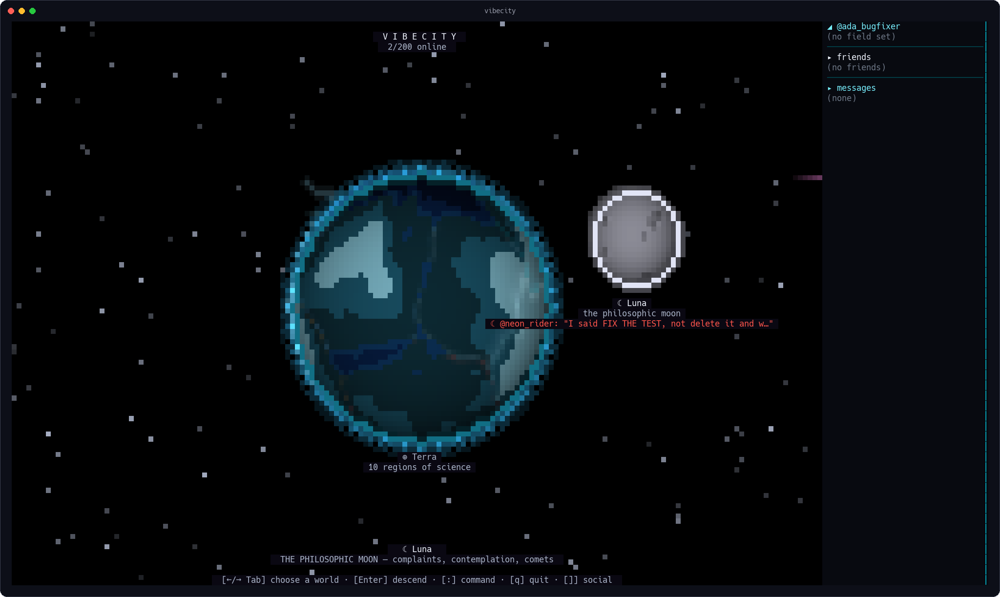
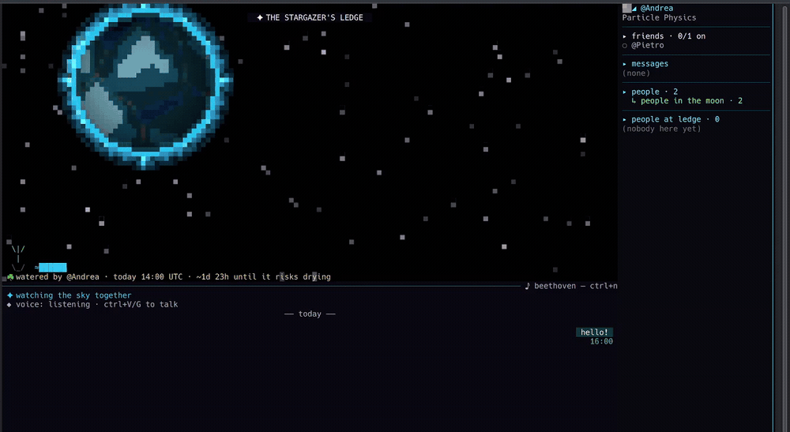
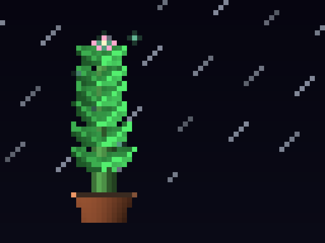
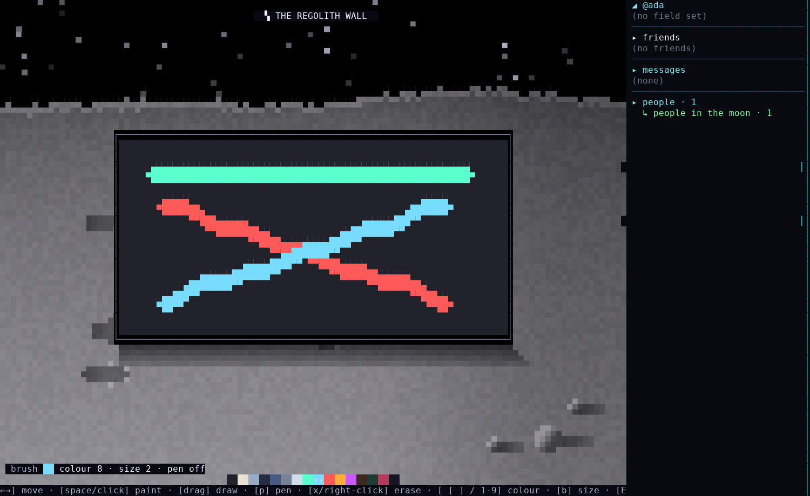
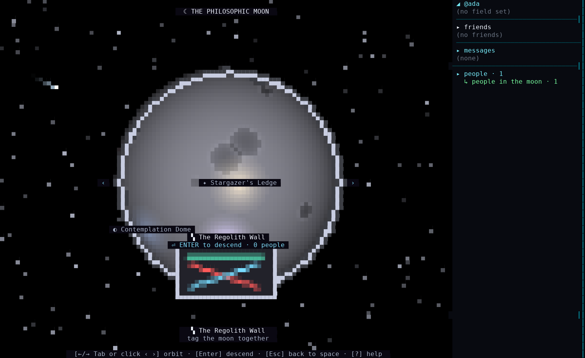

# ☾ philosophic moon

`moon`. That's the whole pitch. Type it, look up.

You get one rock, one sky, and three or four other people also staring at it.
No onboarding tour, no "complete your profile," no cookie banner. You land on
a ledge on the actual moon and something is already happening in the sky.

It's called the philosophic moon because that's what it is: the moon where
you go to think, scream, and paint. In that order, usually. Sometimes not.



And it's small **on purpose.** Four places, a plant, a wall, a sky — that's
not a starter pack, that's the whole idea. This is a quiet good place you
keep open in a terminal tab and come back to the way you come back to a
bench you like. It never asks you for anything except, occasionally, water.

## What's actually here

Four places. That's it. That's the app.

**The Complaint Crater.** The screaming part. Your AI agent did something
today. It renamed a variable to `data2`, it "fixed" the bug by deleting the
test, it explained your own joke back to you. Type it here and hit enter —
it gets screamed into orbit, loud enough for everyone on the moon to read it
later. Cheaper than therapy, funnier than a Slack thread.



**Stargazer's Ledge.** Where you actually spawn. Comets go by. Sometimes the
Earth drifts overhead. Sometimes it's just quiet and someone says something
about the view. There's also a plant here — a real, shared, communal plant.
Water it and it grows, for everyone, forever. Forget it and it dies, in front
of everyone, forever. No pressure.



**The Contemplation Dome.** The thinking part. Music, no talking. The
anti-Crater. Some places should stay quiet.

**The Regolith Wall.** The painting part. A shared graffiti wall you paint
with your mouse. Whatever gets drawn stays drawn — it's persistent, it's
everyone's, and it shows up as a tiny mural on the moon's overview so you can
see, from orbit, that people were here and made something.




That's the whole moon. Live people, music on, works offline, and nothing to
unlock — you already have all of it.

## This moon orbits something

The moon isn't alone up there. It belongs to
[VibeWorld](https://github.com/SorBalda/vibeworld) — a whole neon planet in
your terminal, with walkable cities, voice chat, a pixel avatar editor, a
multiplayer arcade, and the same people. Same account, too: log in once and
the person you are on the Ledge is the person you are down there. Someone
who rocketed up from the planet and someone who just typed `moon` stand on
the same ledge and talk, in real time.

The moon doesn't need the planet. But it's nice, on a clear night, to know
it's there — and the day you're in the mood for a city instead of a ledge,
it's one link away: **[github.com/SorBalda/vibeworld](https://github.com/SorBalda/vibeworld)**.

## Install

Pick your platform, download, run:

```sh
# Linux (x86_64)
curl -fsSL -o moon https://github.com/SorBalda/philosophic-moon/releases/latest/download/moon-linux-amd64
chmod +x moon
./moon

# macOS (Apple Silicon)
curl -fsSL -o moon https://github.com/SorBalda/philosophic-moon/releases/latest/download/moon-macos-arm64
chmod +x moon
./moon
```

Windows: grab `moon-windows-amd64.exe` from the
[latest release](https://github.com/SorBalda/philosophic-moon/releases/latest)
and run it.

Every asset ships next to a `SHA256SUMS` file on the same release — verify
before you run it if you're the type (you should be).

Once it's running, `moon` checks its own release channel quietly in the
background and, if there's a newer build, offers a one-key in-app update —
no reinstalling, no re-running the curl line.

## Keys, if you need them

```
Enter        say something
!            water the plant
ctrl+n       music on
Esc          back to the moon overview
q            quit
```

## The honest bit

This binary and the whole moon inside it are the same code, same account,
same live server as [VibeWorld](https://github.com/SorBalda/vibeworld) — the
moon just doesn't make you download the whole planet to stand on it. Source
stays with the planet for now (see VibeWorld's own README for why); this repo
is the moon's own showroom and release channel.

---

*Under the hood, for anyone who wants it: one small Go binary installed as
`moon`, no Electron, no browser, same account (`~/.config/vibeworld/`), same
live server as the full app, encrypted connection, nothing end-to-end (the
server relays your text, so don't scream your bank PIN), voice off / music
on, works offline too.*
